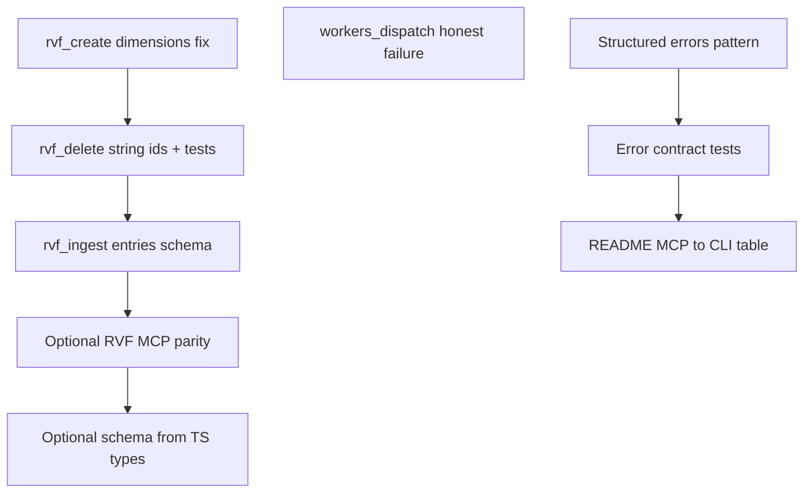

# Ordered backlog from CLI/MCP nomenclature research

## Framing (how this backlog was built)

A **design-before-implementation** pass was used for **context, success criteria, and phased options** — not as a mandate to write a new design file in this step:

- **Context:** Research already defines scope ([`npm/packages/ruvector`](npm/packages/ruvector)), sources, and non-goals (Rust `rvf-cli`).
- **Success criteria:** An ordered todo list where **high-severity contract/ergonomics issues** are fixed first, **tests** lock behavior before broad refactors, and **docs** follow stable behavior.
- **Approaches (pick one when executing):**
  - **A — Tight phased (recommended):** Fix P0 MCP bugs + tests, then schema/docs, then optional parity/codegen.
  - **B — Parallel tracks:** RVF fixes and `workers_dispatch` in parallel (no code dependency between them); merge risk is only touch conflicts in [`bin/mcp-server.js`](npm/packages/ruvector/bin/mcp-server.js).
  - **C — Big-bang:** Introduce shared schema generation from `@ruvector/rvf` types first — higher upfront cost; only choose if avoiding drift is the top priority.

## Sequential thinking (ordering rationale)

Chain summary: split work into **contract bugs** (`rvf_create` / `rvf_delete`), **misleading success** (`workers_dispatch`), **schema tightening** (`rvf_ingest`), then **cross-cutting** errors/docs/optional codegen. `workers_dispatch` is **independent** of RVF; in a **single-threaded** list it still sits in the **P0 band** after RVF create/delete because those unblock realistic **ingest → delete** integration tests called out in research §6.

## Coverage gaps vs research (what was missing before this revision)

| Research area | Previously | Now |
|---------------|------------|-----|
| Scope sources | Plan centered on `mcp-server.js` only | Explicit **rvf-wrapper** review todo; key files add `rvf-wrapper.ts` and `database.ts` |
| §2.4 `hooks_init` | Only implied by README table | **Dedicated todo:** MCP args vs `--minimal` / `--fast` or documented omission |
| §2.4 loose `object` schemas | Not listed | **Audit todo** for untyped nested blobs |
| Exec summary #9 | MCP-only optional parity | **CLI `rvf create`** parity called out (CLI also lacks flags today) |
| §3 cross-cutting conventions | Folded into “README table” | **Conventions subsection** todo (vocabulary + mapping rules, not only tool-by-tool) |
| §5 client-side validation | Not explicit | **Breaking-change / semver** todo for `rvf_delete` schema change |
| §2.1 `rvf_examples` partial | Not mentioned | **Optional** CLI filter parity todo |
| §2.7–2.8 edge/decompile | Not mentioned | **No default work** — aligned per research; only revisit if audit finds regressions |
| Verification | Not in backlog | Run **`npm test`** (and package build) under `npm/packages/ruvector` after MCP changes |

## Ordered todo list (implementation order)

1. **`rvf_create`: map MCP `dimension` → library `dimensions`**  
   Align handler with `RvfOptions` / `mapOptionsToNative` ([`npm/packages/rvf/src/backend.ts`](npm/packages/rvf/src/backend.ts) per research). In schema, prefer **backward compatibility**: accept `dimension` and/or add `dimensions`, document alias. Touch: tool definition and handler near `case 'rvf_create'` in [`bin/mcp-server.js`](npm/packages/ruvector/bin/mcp-server.js) (~3002). **Also** confirm [`src/core/rvf-wrapper.ts`](npm/packages/ruvector/src/core/rvf-wrapper.ts) and any `createRvfStore` call path do not strip or misname `dimensions` (research scope).

2. **`rvf_delete`: align JSON Schema with `RvfDatabase.delete(ids: string[])`**  
   Change `ids` to `string[]` or `oneOf` string/number; **coerce to string** in handler before `store.delete`. Touch: schema + `case 'rvf_delete'` (~3052). Cross-check [`npm/packages/rvf/src/database.ts`](npm/packages/rvf/src/database.ts) / types for ID semantics. **Breaking:** strict MCP clients may have relied on `number[]`; document in changelog and optional migration note (see new todo).

3. **Integration test: delete uses string IDs from ingest/query results**  
   Satisfies research §6 epic 2 — proves end-to-end contract. Likely under [`npm/packages/ruvector/test/`](npm/packages/ruvector/test/) (extend existing MCP/integration patterns).

4. **`workers_dispatch`: on subprocess failure return `success: false`**  
   Include `stderr`, exit code, and `hint` (e.g. `workers_status`, `agentic-flow`). Touch: `case 'workers_dispatch'` (~2731) and tool schema if response shape is documented.

5. **`rvf_ingest.entries`: tighten `items` to `RvfIngestEntry` shape**  
   At minimum `id`, `vector`, optional metadata per [`npm/packages/rvf/src/types.ts`](npm/packages/rvf/src/types.ts).

6. **Optional RVF MCP parity (second wave)**  
   Research §6 epic 1 / §4 item 9: expose selected `RvfOptions` on `rvf_create` (`ef_construction` → `efConstruction`, `m`, `compression`) and optionally `rvf_query` options (`ef_search`, `filter`) — only if product intent is feature parity, not just nomenclature fixes.

7. **Structured error envelope**  
   Research §4 item 5: where the server validates input, add stable fields (`code`, `field`, `expectedKeys`) in addition to existing `hint` for missing packages.

8. **Error contract tests**  
   Research §6 epic 4: golden assertions for representative failures (package missing → `hint`; validation → `field`/`expectedKeys`; `workers_dispatch` failure → `success: false`).

9. **README + conventions doc (§3)**  
   Per research §4 item 6 **and** §3: tool-level “MCP arg → CLI” for high-traffic tools (RVF, workers, `hooks_init`, brain) **plus** cross-cutting rules — `snake_case` JSON vs kebab flags, path vocabulary (`path` vs `parent_path`/`child_path` vs `db_path`), and where camelCase is intentional (`workerId`). Include `db_path` → `path` for `rvlite_*` (§2.5).

10. **`hooks_init` MCP vs CLI**  
   Either add MCP `inputSchema` properties that mirror important CLI-only flags (`--minimal`, `--fast`, etc.) or explicitly document “CLI-only; not exposed on MCP” to avoid author confusion (research §2.4).

11. **Loose nested `object` schemas (hooks)**  
   Inventory tools that use `type: 'object'` without `properties` for nested payloads; tighten or mark documented/unsupported (research §2.4).

12. **CLI / MCP surface drift**  
   When adding `RvfOptions` to MCP, decide whether **CLI** `rvf create` should gain matching flags so both surfaces stay aligned (research executive summary row 9).

13. **Backlog / optional (non-blocking)**  
    - Generate MCP `inputSchema` fragments from `@ruvector/rvf` TypeScript types (research §6 epic 5).  
    - Low-severity aliases: `hooks_recall.top_k` vs mental model `topK`; standardizing `workerId` to `worker_id` — **breaking** MCP revision; separate epic.  
    - `rvf_examples`: optional CLI `--filter` (or equivalent) to match MCP `filter` (research §2.1 partial).  
    - Edge, identity, decompile: no items required by research unless an audit finds mismatches.

14. **Release hygiene**  
    Changelog / semver note for any MCP `inputSchema` breaking change (`rvf_delete` especially).

## Key files

| Area | File |
|------|------|
| MCP tool schemas + handlers | [`npm/packages/ruvector/bin/mcp-server.js`](npm/packages/ruvector/bin/mcp-server.js) |
| RVF store wiring (research scope) | [`npm/packages/ruvector/src/core/rvf-wrapper.ts`](npm/packages/ruvector/src/core/rvf-wrapper.ts) |
| Commander CLI (parity checks) | [`npm/packages/ruvector/bin/cli.js`](npm/packages/ruvector/bin/cli.js) |
| Canonical RVF types/options | [`npm/packages/rvf/src/types.ts`](npm/packages/rvf/src/types.ts), [`npm/packages/rvf/src/backend.ts`](npm/packages/rvf/src/backend.ts), [`npm/packages/rvf/src/database.ts`](npm/packages/rvf/src/database.ts) |
| Tests | [`npm/packages/ruvector/test/`](npm/packages/ruvector/test/) — run **`npm test`** after changes |
| Related inventory | [`../analysis/ruvector/CLI_MCP_ECOSYSTEM_RESEARCH.md`](../analysis/ruvector/CLI_MCP_ECOSYSTEM_RESEARCH.md) |

## Cross-plan audit (structured review + sequential thinking)

**Purpose:** This plan owns **MCP contract correctness** and **schema/error ergonomics** on `mcp-server.js`; sibling plans own **CLI↔MCP feature parity** and **RVF/rvlite persistence truth**.

| Nomenclature todo | Relationship to other plans |
|-------------------|----------------------------|
| P0 RVF delete/create/workers | **Prerequisite** for [ecosystem E1/E2](./cli_mcp_ecosystem_research_todos_beb308b1.plan.md) |
| `readme-mcp-cli-table` | Overlaps ecosystem `docs-parity-surface-matrix` + persistence `p2-c2` — **one canonical doc**, others link (see ecosystem `coord-mcp-rvf-doc-canonical`) |
| `optional-schema-codegen` | Must not fight ecosystem `e3-single-manifest` — use **`coord-optional-codegen-manifest`** |
| `structured-errors` / `error-contract-tests` | Distinct from ecosystem **MCP smoke** (transport + CallTool); both needed |
| `verify-npm-test-ruvector` | Catches regressions before ecosystem parity milestones touch same files |

**Sibling plans:** [CLI MCP ecosystem todos](./cli_mcp_ecosystem_research_todos_beb308b1.plan.md) · [RVF persistence todos](./rvf_persistence_research_todos_45f08914.plan.md) · [Research streams order](./research_streams_execution_order_d0f4d7b3.plan.md)

## Release coordination (`coord-release-semver`)

The P0 `rvf_delete` ids schema change (`number[]` → `string[]` or `oneOf`) is **breaking** for strict MCP clients. Rather than a standalone changelog entry per todo, coordinate with ecosystem [`release-semver-w0-w1`](./cli_mcp_ecosystem_research_todos_beb308b1.plan.md) for **one** npm version bump + CHANGELOG section covering all W0 fixes. See [execution-order semver table](./research_streams_execution_order_d0f4d7b3.plan.md) for wave-level versioning policy.

## Next step after you approve

Optionally expand each todo into **concrete edit steps, test commands, and acceptance checks** for the execution session — unless you prefer to execute directly from this ordered backlog (per [convention decision](./research_streams_execution_order_d0f4d7b3.plan.md)).
