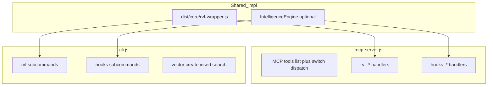

# RuVector CLI vs MCP ecosystem — research and alignment plan

## Methods (as requested)

- **Structured design pass:** treat this document as the **design/research spec** before any implementation; scope is analysis + recommended epics, not shipping code in this phase.
- **Sequential thinking** (MCP `sequentialthinking`): used to structure gaps (RVF deltas, workers, rvlite-only-MCP, optimization hypotheses).
- **No subagents** (same rule as [`rvf_persistence_research_4bac0840.plan.md`](./rvf_persistence_research_4bac0840.plan.md)): one session, normal tools only when you execute the research.

## Primary artifacts

| File | Role |
|------|------|
| [`npm/packages/ruvector/bin/mcp-server.js`](npm/packages/ruvector/bin/mcp-server.js) | MCP stdio server: large tool registry + `switch` dispatch (~3.7k+ lines), `validateRvfPath`, optional `IntelligenceEngine` |
| [`npm/packages/ruvector/bin/cli.js`](npm/packages/ruvector/bin/cli.js) | Commander CLI: vector DB, attention/GNN, hooks, workers, **rvf** subcommands, **mcp** subcommands (`start`, `info`, `tools`, `test`), decompile, etc. |

## Executive picture

- **MCP** is optimized for **agent-facing** operations: dense **hooks_***, **workers_***, **rvf_***, **rvlite_***, **brain_***, **edge_***, **identity_***, **decompile_*** tool surface.
- **CLI** is optimized for **human + scripting**: classic **create / insert / search / stats**, rich **hooks** subtree, **workers** (via `agentic-flow`), **rvf** file ops, **decompile**, diagnostics (**doctor**, **mcp tools** listing).
- **Neither is a strict subset of the other** — several capabilities exist on one side only, and **shared** areas (RVF) diverge in **which** operations are exposed and in **path validation** behavior.

## Confirmed gaps (high signal)

### RVF

| Capability | MCP | CLI |
|------------|-----|-----|
| delete vectors | **Yes** (`rvf_delete`) | **No** dedicated `ruvector rvf delete` |
| export metadata/status JSON | **No** `rvf_export` tool | **Yes** (`rvf export`) |
| examples / download | `rvf_examples` | `rvf examples`, `rvf download` |
| Path hardening | **`validateRvfPath`** (cwd / blocked prefixes) | **Not the same** — typical `fs` paths from user args |

**Implication:** agents can delete via MCP but humans cannot mirror that from CLI; humans can export from CLI but agents lack a matching tool unless they shell out or compose status+segments manually.

### Workers (agentic-flow bridge)

- **MCP:** `workers_dispatch`, `workers_status`, `workers_results`, `workers_triggers`, `workers_stats`, `workers_presets`, `workers_phases`, `workers_create`, `workers_run`, `workers_custom`, `workers_init_config`, `workers_load_config`.
- **CLI:** same core set **plus** **`workers cleanup`** and **`workers cancel`** (see [`cli.js`](npm/packages/ruvector/bin/cli.js) ~6651+).

**Implication:** lifecycle control (cancel/cleanup) is **CLI-only** today.

### Rvlite query surface

- **MCP only:** `rvlite_sql`, `rvlite_cypher`, `rvlite_sparql` (listed under `mcp tools` help in CLI; no `ruvector rvlite …` commands found in CLI grep).

**Implication:** scripts cannot invoke rvlite query tools without MCP or custom Node code.

### Brain / edge / identity / decompile

- **MCP:** full tool set (`brain_*`, `edge_*`, `identity_*`, `decompile_*`).
- **CLI:** **`ruvector mcp tools`** documents them; **no parallel** `ruvector brain …` CLI (by design or omission — research should state explicitly and link to env/API requirements).

### Vector DB (non-RVF)

- **CLI:** `create`, `insert`, `search`, `stats`, `export`, `import`, `benchmark`, etc.
- **MCP:** **no** first-class mirror of `insert`/`search` as dedicated tools (hooks/memory paths are adjacent but not the same API).

**Implication:** “vector DB from agents” vs “RVF from agents” are asymmetric.

## Optimization and maintainability (hypotheses to validate in research)

1. **Monolithic MCP file** — splitting handlers (e.g. `handlers/rvf.js`, `handlers/hooks.js`) and **lazy `require`** reduces startup memory and clarifies ownership.
2. **Single manifest** — one JSON/TS map: `toolId`, description, JSON schema, `cliEquivalent`, `handlerModule` — generates MCP `ListTools` output and **`ruvector mcp tools`** / docs to eliminate drift.
3. **Shared RVF path policy** — extract `validateRvfPath` (or shared option) for CLI `rvf` subcommands where safe, or document intentional difference (interactive vs agent).
4. **`MCP_SERVER=1`** — comment in [`mcp-server.js`](npm/packages/ruvector/bin/mcp-server.js) line 14–15: verify/document interaction with worker parallelism vs CLI’s “disables parallel workers” comment in [`cli.js`](npm/packages/ruvector/bin/cli.js) line 3–4.
5. **IntelligenceEngine** — defer initialization until first hooks tool that needs it (if not already), to improve cold `list_tools` latency.

## Recommended research workflow (execution phase)

1. **Extract inventories** — script or manual table: all MCP `name:` tools from `mcp-server.js` vs all `program.command` / nested `command(` from `cli.js` (segment by domain: rvf, hooks, workers, brain, …).
2. **Parity matrix** — rows = user-facing capabilities; columns = MCP / CLI / shared module / notes (gap, security, param naming).
3. **Trace three golden paths** — (a) RVF create→ingest→query→delete→compact, (b) hooks_stats + hooks_route, (c) workers dispatch→status→cancel/cleanup — record which entrypoints exist.
4. **Review tests** — [`npm/packages/ruvector/test/cli-commands.js`](npm/packages/ruvector/test/cli-commands.js), [`test/integration.js`](npm/packages/ruvector/test/integration.js); identify missing MCP parity tests (optional: stdio fixture).
5. **Produce deliverable doc** — mirror structure of [`../analysis/rvf/RVF_PERSISTENCE_ECOSYSTEM_RESEARCH.md`](../analysis/rvf/RVF_PERSISTENCE_ECOSYSTEM_RESEARCH.md): matrix, gaps, epics, references (suggested path: `../analysis/ruvector/CLI_MCP_ECOSYSTEM_RESEARCH.md` + index link if you maintain one).

## Suggested epics (after research sign-off)

| Epic | Goal | Test criteria |
|------|------|----------------|
| **E1 — RVF parity** | Add `ruvector rvf delete` **or** document; add `rvf_export` MCP **or** document workaround | CLI and MCP both cover delete/export; same wrapper behavior |
| **E2 — Workers parity** | Expose `workers_cancel` / `workers_cleanup` (or named equivalents) on MCP | MCP can mirror CLI lifecycle |
| **E3 — Manifest** | Single source for tool definitions + CLI help | Adding a tool updates one file; snapshot test for tool count/names |
| **E4 — Path policy** | Align or document RVF path validation between MCP and CLI | Security review + short ADR or README section |
| **E5 — Rvlite CLI (optional)** | Thin `ruvector rvlite sql|cypher|sparql` delegating to same code as MCP | Scripting parity with MCP tools |

## Out of scope (unless you expand)

- Non-`ruvector` npm packages’ MCP servers (e.g. separate `pi-brain` transports).
- Replacing Commander or MCP SDK — only suggest if manifest work makes it worthwhile.
