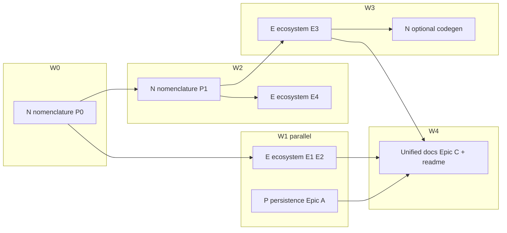

# Ordering: nomenclature todos vs ecosystem vs persistence research

## Framing (how this doc was built)

- **Goal:** Decide **before / after / between / parallel** for the existing nomenclature backlog ([`cli_mcp_nomenclature_todos_e2d8271a.plan.md`](./cli_mcp_nomenclature_todos_e2d8271a.plan.md)) against work implied by [CLI_MCP_ECOSYSTEM_RESEARCH.md](../analysis/ruvector/CLI_MCP_ECOSYSTEM_RESEARCH.md) and [RVF_PERSISTENCE_ECOSYSTEM_RESEARCH.md](../analysis/rvf/RVF_PERSISTENCE_ECOSYSTEM_RESEARCH.md).
- **Success criteria:** Clear **waves** with explicit **dependencies**, **merge points** for overlapping docs, and **parallel tracks** where packages differ (`npm/packages/ruvector` vs `npm/packages/rvlite` vs `npm/packages/rvf`).
- **Approaches considered:**
  - **A (recommended):** **Nomenclature P0 first** — fix incorrect MCP contracts before adding CLI parity or new MCP tools that copy those contracts.
  - **B:** **Ecosystem E3 manifest first** — reduces drift early, but churns while schemas are still wrong (nomenclature fixes would force manifest regen).
  - **C:** **Persistence Epic A first** — valid if rvlite honesty is the top product risk; it does **not** unblock nomenclature bugs in `mcp-server.js`.

**Recommendation:** **A**, with **persistence Epic A** on a **parallel branch** (separate package) if capacity allows.

## Cross-plan audit pointer

For **per-plan ownership, prerequisite links, and anti-duplication** (canonical MCP vs Rust `rvf` CLI docs, rvlite wording vs persistence Epic A, manifest vs optional schema codegen, MCP smoke vs Node lifecycle tests, and `validateRvfPath` single owner), see the **“Cross-plan audit”** sections in [cli_mcp_nomenclature_todos_e2d8271a.plan.md](./cli_mcp_nomenclature_todos_e2d8271a.plan.md), [cli_mcp_ecosystem_research_todos_beb308b1.plan.md](./cli_mcp_ecosystem_research_todos_beb308b1.plan.md), and [rvf_persistence_research_todos_45f08914.plan.md](./rvf_persistence_research_todos_45f08914.plan.md)—this execution-order doc stays at **wave sequencing**; those three list the **coordination todos** (`coord-mcp-rvf-doc-canonical`, `coord-rvlite-doc-persistence`, `dedupe-p2c2-ecosystem-docs`, `coord-optional-codegen-manifest`, etc.) that implementers should tick alongside the waves below.

## Sequential thinking (dependency summary)

1. **Nomenclature P0** (`rvf_create` → `dimensions`, `rvf_delete` string IDs + tests, `workers_dispatch` honest failure) removes **false success** and **wrong types** that agents and strict MCP clients hit today.
2. **Ecosystem E1** (CLI `rvf delete`, MCP `rvf_export` or documented workaround) should assume **correct delete ID contract** — implement **after** nomenclature `rvf_delete` fix + test, or **with** it in one branch if tightly coordinated.
3. **Ecosystem E2** (MCP `workers_cancel` / `workers_cleanup`) is mostly **orthogonal** to RVF, but should follow **honest `workers_dispatch` errors** so the workers MCP group has a consistent failure story.
4. **Persistence Epic A** (`npm/packages/rvlite` honesty: README/JSDoc vs JSON envelope) is **in parallel** with ruvector nomenclature — different crate; only **soft** coupling via MCP `rvlite_*` docs (nomenclature already tracks `db_path` → `path`).
5. **Ecosystem E4** (path policy / shared `validateRvfPath`) aligns with nomenclature **conventions + security** — best in **wave 2** once P0 behavior is stable, or documented as interim policy during P0.
6. **Ecosystem E3** (single tool manifest) overlaps nomenclature **optional schema codegen** — schedule **after** P0 schema corrections (and ideally after E1/E2 add/remove tools) to avoid repeated manifest regeneration.
7. **Persistence Epic C** (known limitations / MCP vs CLI delta) **merges** nomenclature README work and ecosystem parity matrix — **late wave** to reduce doc thrash.
8. **Persistence B / D / E** and **E5** (rvlite thin CLI) are **long-horizon**; they do not gate nomenclature P0.

## Wave model (recommended execution order)

| Wave | Stream | Contents | Relation to nomenclature list |
|------|--------|----------|--------------------------------|
| **W0** | **N — P0** | `rvf_create` dimensions, `rvf_delete` schema+handler+integration test, `workers_dispatch` failure JSON, `rvf-wrapper` review | **This is the nomenclature todo list head** — do **first** |
| **W1** | **E — E1** | CLI `rvf delete` + MCP `rvf_export` **or** explicit docs workaround ([ecosystem §8 gap list](../analysis/ruvector/CLI_MCP_ECOSYSTEM_RESEARCH.md)) | **After W0** (same ID semantics as fixed MCP) |
| **W1** | **E — E2** | MCP workers `cancel` / `cleanup` parity | **After** nomenclature `workers_dispatch` item; **parallel** with E1 on another branch if desired |
| **W1** | **P — Epic A** | rvlite honesty (`npm/packages/rvlite`) | **Parallel track** — not before/after N in a hard sense |
| **W2** | **N — P1** | `rvf_ingest` schema, structured errors, error contract tests, breaking-change note | Continuation of nomenclature plan |
| **W2** | **N — mid-tier** | `hooks_init` MCP vs CLI flags (or explicit “CLI-only” doc), loose nested `object` schema audit, optional `rvf_examples` / CLI filter (if product wants) | Same band as P1 or spill to **W3** if large; ties to [nomenclature research §2.4](../analysis/ruvector/CLI_MCP_NOMENCLATURE_RESEARCH.md) |
| **W2** | **E — E4** | Path policy: document MCP strict vs CLI or shared validator + optional `--allow-outside-cwd` | **Interleaved with** N conventions / structured errors |
| **W2** | **E — §6 tests (partial)** | MCP smoke (`mcp test` / mocked stdio), RVF path traversal test — **before or with** parity checklist | Ecosystem §6 items 1 + 3; item 2 (parity checklist) still **blocked on E3 manifest** |
| **W3** | **E — E3** + **N optional** | Single manifest; optional codegen from `@ruvector/rvf` types; **parity checklist test** from manifest (ecosystem §6.2) | **After** tool list + schemas stabilize |
| **W3** | **N optional** | `rvf_create`/`rvf_query` expanded options + **CLI `rvf create` flag parity** ([nomenclature plan](./cli_mcp_nomenclature_todos_e2d8271a.plan.md) `cli-rvf-create-parity` / `rvf-mcp-parity-optional`) | Product-shaped; can trail manifest if it changes tool schemas |
| **W4** | **Docs merge** | N readme/conventions + ecosystem golden paths + **P Epic C** known-limitations | **After** W2 technical truth; includes [persistence §4](../analysis/rvf/RVF_PERSISTENCE_ECOSYSTEM_RESEARCH.md) Wasm vs Node table + [ecosystem §4 matrix](../analysis/ruvector/CLI_MCP_ECOSYSTEM_RESEARCH.md) + **MCP vs Rust `rvf` CLI delta** ([persistence §8](../analysis/rvf/RVF_PERSISTENCE_ECOSYSTEM_RESEARCH.md)) |
| **W4** | **Ecosystem §7 docs** | `MCP_SERVER=1` vs CLI worker behavior; **IntelligenceEngine** defer-until-first-use (optional perf work — can be W3 engineering) | Reduces operator confusion; not blocked on RVF contract fixes |
| **W4** | **Persistence §7** | RuVocal `rvf.ts` “RVF database” JSON vs binary RVF — **documentation-only** ([persistence §7](../analysis/rvf/RVF_PERSISTENCE_ECOSYSTEM_RESEARCH.md)) | `ui/ruvocal` comments or linked doc |
| **W5+** | **P — B/D/E**, **E5** | Wasm durability MVP, core migration spike, sidecar robustness, optional `ruvector rvlite` CLI | **Deferred**; orthogonal to nomenclature P0 |
| **W5+** | **E — §7 refactor** | Split `mcp-server.js` by domain; lazy `require` per tool group | Ecosystem §7.1 — **maintainability**; optional same window as E3 |
| **Out of scope** | **Product / other crates** | Dedicated MCP tools for **vector DB** `insert`/`search` ([ecosystem §8](../analysis/ruvector/CLI_MCP_ECOSYSTEM_RESEARCH.md)); **native run** CLI-only; **mcp-brain-server** / **ruvllm** / **ruvector-core** migration ([persistence §8–10](../analysis/rvf/RVF_PERSISTENCE_ECOSYSTEM_RESEARCH.md)) | Track separately; not sequenced with `npm/packages/ruvector` nomenclature waves |

## Overlap map (what to merge, not duplicate)

- **Ecosystem §6–7 test recommendations** (MCP smoke, parity checklist, path tests) land **with** W2–W3 as schemas and tool inventory stabilize—not before W0 fixes.
- **Ecosystem §7 monolith split / lazy require** is **maintainability**; can trail W0–W1 or ride with E3.

## Coverage audit (double-check vs research — previously missing)

| Source | Item | Where it now lands |
|--------|------|-------------------|
| [Ecosystem §8](../analysis/ruvector/CLI_MCP_ECOSYSTEM_RESEARCH.md) | **Vector DB on MCP** (if desired) | **Out of scope** row — product fork, not default backlog |
| [Ecosystem §8](../analysis/ruvector/CLI_MCP_ECOSYSTEM_RESEARCH.md) | Rvlite **MCP-only** vs thin CLI (E5) | **W5+** with E5; interim: **W4** docs can state “query via MCP `rvlite_*`” |
| [Ecosystem §3](../analysis/ruvector/CLI_MCP_ECOSYSTEM_RESEARCH.md) | `hooks_algorithms_list` vs CLI `hooks learning-config --list` | **W4** unified docs / limitations |
| [Ecosystem §3](../analysis/ruvector/CLI_MCP_ECOSYSTEM_RESEARCH.md) | CLI-only hooks (`session-start`, `pre-edit`, …) | **W4** docs — not MCP parity unless product asks |
| [Persistence §6](../analysis/rvf/RVF_PERSISTENCE_ECOSYSTEM_RESEARCH.md) | Node RVF lifecycle test; rvlite on-disk truth; sidecar missing; WasmBackend throws | **persistence-tests-backlog** todo — align **A/Epic A** with (2), **Epic E** with (3), **Epic B** with (4); Node lifecycle fits **after W1** when `RUVECTOR_BACKEND=rvf` path stable |
| [Persistence §10](../analysis/rvf/RVF_PERSISTENCE_ECOSYSTEM_RESEARCH.md) | rvlite README vs code, `getStorageBackend()` | Subsumed by **Epic A** (W1 parallel) |
| [Nomenclature plan](./cli_mcp_nomenclature_todos_e2d8271a.plan.md) | `hooks_init`, loose schemas, `cli-rvf-create-parity`, optional examples | **W2 mid-tier** + **W3** optional parity (see wave table) |

**Epic order check:** [Ecosystem §9](../analysis/ruvector/CLI_MCP_ECOSYSTEM_RESEARCH.md) lists **E4 before E3** — this plan uses **W2 (E4) → W3 (E3)**, consistent.

## Direct answers (before / after / between)

| Question | Answer |
|----------|--------|
| Nomenclature vs **Ecosystem E1** | **Before** (at least P0 delete/create/dispatch) |
| Nomenclature vs **Ecosystem E2** | **P0 dispatch fix before**; E2 **after or parallel** with E1 |
| Nomenclature vs **Ecosystem E3** | **After** P0 (and ideally after E1/E2 scope settled) |
| Nomenclature vs **Ecosystem E4** | **Between** P0 and manifest, often **with** P1 docs/errors |
| Nomenclature vs **Persistence Epic A** | **Parallel** (other package), not a gate |
| Nomenclature vs **Persistence Epic C** | **After** N+E technical slices — **between** P1 and long-horizon P epics |
| Nomenclature vs **Persistence B/D/E** | **After** or fully **parallel**; no blocking |

## Convention decision (Apr 2026)

**Backlog convention:** ordered plan files under `aigentic/plans/` are the team's source of truth. A short **completeness and prioritization pass** (context, success criteria, a few approaches, recommendation) is applied at authoring time — not as a mandate for `docs/plans/YYYY-MM-DD-*-design.md` or a heavy section-by-section approval loop. Expanding each item into concrete edit steps is **optional per implementer** — some waves are small enough to execute directly from the backlog.

This means: no separate design doc is required per stream unless a wave touches 3+ packages or introduces a new public API surface.

## Cross-cutting: semver / changelog / MCP contract comms

**Owner:** Whoever ships the first W0 PR opens a draft CHANGELOG section; subsequent W0/W1 PRs append to it.

| Wave | Breaking / additive | Action |
|------|---------------------|--------|
| **W0** (nomenclature P0) | **Breaking:** `rvf_delete` ids `number[]` → `string[]`; **Fix:** `rvf_create` dimensions passthrough; **Fix:** `workers_dispatch` failure shape | One **minor** or **major** bump (assess client impact); CHANGELOG notes all three; consider `oneOf` deprecation period for `rvf_delete` |
| **W1** (ecosystem E1/E2) | **Additive:** CLI `rvf delete`, MCP `rvf_export` or docs, MCP `workers_cancel`/`workers_cleanup` | **Minor** bump; CHANGELOG "new commands/tools" section |
| **W2+** | Schema tightening (`rvf_ingest` items), structured errors, path policy | **Patch** or **minor** per scope; CHANGELOG per PR |

**Coordination todos:** nomenclature [`coord-release-semver`](./cli_mcp_nomenclature_todos_e2d8271a.plan.md), ecosystem [`release-semver-w0-w1`](./cli_mcp_ecosystem_research_todos_beb308b1.plan.md).

## References

- Nomenclature backlog: [`cli_mcp_nomenclature_todos_e2d8271a.plan.md`](./cli_mcp_nomenclature_todos_e2d8271a.plan.md)
- [CLI_MCP_NOMENCLATURE_RESEARCH.md](../analysis/ruvector/CLI_MCP_NOMENCLATURE_RESEARCH.md) — contract bugs and naming (drives **W0–W2**)
- [CLI_MCP_ECOSYSTEM_RESEARCH.md](../analysis/ruvector/CLI_MCP_ECOSYSTEM_RESEARCH.md) — epics E1–E5, §3 CLI-only surfaces, §6–8 gaps and tests
- [RVF_PERSISTENCE_ECOSYSTEM_RESEARCH.md](../analysis/rvf/RVF_PERSISTENCE_ECOSYSTEM_RESEARCH.md) — epics A–E, §6–8 tests, §7 RuVocal naming, peripheral scope boundaries
