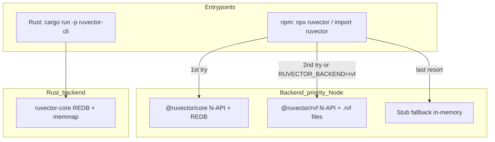

# Running RuVector: Pre-Modification Reference Guide

## Architecture overview

RuVector has two distinct entrypoints and three persistence backends. Understanding this stack is essential before choosing a path.



**Pre-built native binaries exist for all three target platforms:**

- macOS ARM: `ruvector-core-darwin-arm64`, `@ruvector/rvf-node-darwin-arm64`
- macOS x86: `ruvector-core-darwin-x64`, `@ruvector/rvf-node-darwin-x64`
- Linux ARM: `ruvector-core-linux-arm64-gnu`, `@ruvector/rvf-node-linux-arm64-gnu`

No compilation required on any of these platforms when using the npm path.

---

## Recommended path: npm SDK with native backend

This is the cleanest path. It gives you the CLI, MCP server, hooks intelligence, and persistence out of the box.

### Prerequisites

- **Node.js 18+** (required by `engines` field)
- **npm / pnpm / yarn / bun** (any; CLI auto-detects)
- No Rust toolchain needed (pre-built native binaries)

### Step 1 -- Install

```bash
mkdir my-ruvector-project && cd my-ruvector-project
npm init -y

# Core install -- pulls native binary for your platform automatically
npm install ruvector

# RVF persistence (optional but recommended for canonical .rvf files)
npm install @ruvector/rvf
```

What installs:
- `ruvector` (0.2.22) -- CLI + MCP server + hooks + 95 MCP tools
- `@ruvector/core` (0.1.30) -- native REDB backend (auto-resolved dependency)
- `@ruvector/rvf` (0.2.0) -- RVF format backend + `@ruvector/rvf-node` N-API bindings

### Step 2 -- Verify platform detection

```bash
npx ruvector info
```

Expected output on macOS ARM:
```
Platform: darwin-arm64
Implementation: native (Rust)
```

If it says "wasm" or "stub", the native binary failed to load -- check Node version and architecture match.

### Step 3 -- Choose persistence backend

**Option A: Default (`@ruvector/core` REDB) -- zero config**

```bash
# Data persists in REDB format (not .rvf)
npx ruvector create mydb.vec --dimensions 384 --metric cosine
npx ruvector insert mydb.vec vectors.json
npx ruvector search mydb.vec --vector "[0.1,0.2,...]" --top-k 10
npx ruvector stats mydb.vec
```

**Option B: RVF backend -- canonical `.rvf` files (ADR-029 format)**

```bash
export RUVECTOR_BACKEND=rvf

# RVF file operations
npx ruvector rvf create mydb.rvf -d 384 --metric cosine
npx ruvector rvf ingest mydb.rvf --input vectors.json --format json
npx ruvector rvf query mydb.rvf --vector "[0.1,0.2,...]" --k 10
npx ruvector rvf status mydb.rvf
npx ruvector rvf compact mydb.rvf
npx ruvector rvf export mydb.rvf --output dump.json
```

RVF gives you: segmented binary format, COW branching (`rvf derive`), compaction, export, and cross-platform file portability.

### Step 4 -- MCP server for Claude Code / Cursor

```bash
# Register with Claude Code
claude mcp add ruvector -- npx ruvector mcp start

# Or run standalone (stdio transport)
npx ruvector mcp start
```

This exposes 95+ tools (hooks, workers, rvf, rvlite, brain, edge, identity, decompile) to any MCP client.

### Step 5 -- Initialize self-learning hooks

```bash
# Full setup: hooks config + pretrain from git history + agent generation
npx ruvector hooks init --pretrain --build-agents quality

# Verify hooks are working
npx ruvector hooks stats
npx ruvector hooks doctor
```

This creates `.ruvector/intelligence.json` in your project root (add `.ruvector/` to `.gitignore`).

### Step 6 -- Optional packages

```bash
# Interactive package browser
npx ruvector install -i

# Or install specific capabilities
npx ruvector install gnn          # Graph Neural Networks
npx ruvector install graph-node   # Hypergraph database
npx ruvector install attention    # 50+ attention mechanisms
```

---

## Alternative path: Rust CLI (from source)

Use this when you want the Rust-native binary directly or need to build custom features.

### Prerequisites

- **Rust 1.77+** (workspace `rust-version`)
- **C/C++ compiler** (for native deps)
- macOS: `xcode-select --install`
- Linux ARM: `apt install build-essential` (or equivalent)

### Build and run

```bash
cd /path/to/ruvector

# Build all workspace crates (release)
cargo build --release

# Run CLI
cargo run -p ruvector-cli -- info
cargo run -p ruvector-cli -- create mydb.vec --dimensions 384

# Run MCP server (separate binary)
cargo run -p ruvector-cli --bin ruvector-mcp

# Run tests
cargo test --workspace
```

The Rust CLI uses **ruvector-core** (REDB) directly -- no Node.js, no npm, no backend fallback chain. Data is stored in REDB format.

Note: the `crates/rvf/` tree is **excluded** from the main Cargo workspace (`Cargo.toml` line 2). To build RVF Rust crates, build them independently:

```bash
cd crates/rvf && cargo build --release
cd crates/rvf && cargo run --example generate_all   # generate sample .rvf files
```

---

## Platform-specific notes

### macOS ARM (Apple Silicon M1-M4)

- Native binaries work out of the box via npm
- Rosetta not needed (arm64 binaries published)
- If building Rust from source, no special flags needed -- `cargo build` targets native arch

### macOS x86 (Intel)

- Same as ARM; separate x86_64 binaries published
- If running on Apple Silicon under Rosetta, npm will pull x64 binaries -- works but slower

### Linux ARM (aarch64)

- Pre-built binaries: `ruvector-core-linux-arm64-gnu`, `@ruvector/rvf-node-linux-arm64-gnu`
- Requires glibc (GNU) -- musl/Alpine not supported by published binaries
- For Raspberry Pi OS (64-bit Debian-based): works directly
- For Alpine/musl: build from source with `cargo build --release --target aarch64-unknown-linux-musl`

---

## Known caveats (pre-ADR-A01/A02)

These are the issues documented in our research that exist today, before any fixes:

| Issue | Impact | Workaround |
|-------|--------|------------|
| `rvf_create` MCP sends `dimension` but library expects `dimensions` | Store may use wrong default dimension | Use CLI `rvf create` instead of MCP tool; or pass correct `dimensions` key |
| `rvf_delete` MCP schema says `number[]` but library expects `string[]` | Delete may fail or silently mishandle IDs | Use CLI path or coerce IDs to match |
| `workers_dispatch` returns `success: true` on failure | Agents cannot detect subprocess errors | Check stderr manually; do not trust success field alone |
| rvlite `saveToRvf` writes JSON envelope, not binary RVF | Data labeled "RVF" is actually JSON | Use `@ruvector/rvf` directly for true binary persistence |
| WasmBackend is in-memory only (no file persistence) | Browser/WASM stores lost on reload | Use Node.js with `@ruvector/rvf-node` for persistence |
| No CLI `rvf delete` command | Cannot delete vectors from CLI | Use MCP `rvf_delete` tool (with string ID caveats) |

These will be addressed by [ADR-A01](../adr/ADR-A01-mcp-cli-surface-alignment.md) and [ADR-A02](../adr/ADR-A02-rvf-persistence-layer-completion.md) once approved.

---

## Persistence summary (what survives restarts)

| Backend | Format on disk | Portable across platforms | Notes |
|---------|---------------|---------------------------|-------|
| `@ruvector/core` (default) | REDB (memory-mapped B-tree) | No (platform-specific endianness/alignment) | Fastest; auto-selected |
| `@ruvector/rvf` | Binary `.rvf` segments | Yes (ADR-029 spec) | Set `RUVECTOR_BACKEND=rvf`; or use `rvf` CLI subcommands |
| Rust CLI (`ruvector-cli`) | REDB | No | Direct Rust, no Node.js |
| `.ruvector/intelligence.json` | JSON | Yes | Hooks learning data; separate from vector storage |
| rvlite `saveToRvf` | JSON "RVF1" envelope | Yes (it is JSON) | Despite the name, not binary RVF |

**For the cleanest persistent setup:** install `ruvector` + `@ruvector/rvf`, set `RUVECTOR_BACKEND=rvf`, and use the `rvf` CLI subcommands. Your `.rvf` files are portable between macOS and Linux, both ARM and x86.
