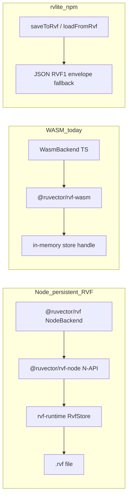

# RVF / ruvector persistence layer — research plan

## Rules for this plan

- **No subagents:** Running this plan must **not** use delegated subagents, the Task/swarm tool, or any parallel multi-agent orchestration. One session does all research, synthesis, verification, and (after explicit approval) implementation directly—using normal tools only (read, search, terminal, edit).

## Context from your agent docs

Treat the referenced files as **role guidance for a single implementer** (how to think and verify)—**not** as permission to spawn subagents. Apply these lenses yourself in sequence as needed:

- **[researcher.md](.claude/agents/core/researcher.md)** — multi-strategy search, dependency mapping, synthesis.
- **[planner.md](.claude/agents/core/planner.md)** — phased rollout, risk, critical path.
- **[tester.md](.claude/agents/core/tester.md)** — cross-runtime matrix (Node / browser / CI), regression on string-ID mappings and crash safety.
- **[coder.md](.claude/agents/core/coder.md)** — minimal diffs aligned with existing patterns.

## Executive answer (is it “completely wired”?)

**No.** What exists today is a **split brain**:

| Surface | Canonical binary `.rvf` on disk | Status |
|---------|----------------------------------|--------|
| **Rust** [`crates/rvf/`](crates/rvf/) (`rvf-runtime`, CLI, adapters) | Yes | Substantial implementation + integration tests under [`crates/rvf/tests/`](crates/rvf/tests/) |
| **Node** [`npm/packages/rvf`](npm/packages/rvf) → [`@ruvector/rvf-node`](crates/rvf/rvf-node/src/lib.rs) | Yes | `NodeBackend` delegates to N-API `RvfStore` ([`backend.ts`](npm/packages/rvf/src/backend.ts)) |
| **WASM (TS `WasmBackend`)** | **No (in-memory only)** | `open` / `openReadonly` explicitly throw ([`backend.ts`](npm/packages/rvf/src/backend.ts) ~526–537) |
| **`@ruvector/rvf-wasm` npm** | Partial | Exports `rvf_store_open(buf, len)` etc. ([`pkg/rvf_wasm.d.ts`](npm/packages/rvf-wasm/pkg/rvf_wasm.d.ts)) — buffer-based, not file paths; no `writeRvf`/`readRvf` |
| **rvlite JS** [`npm/packages/rvlite/src/index.ts`](npm/packages/rvlite/src/index.ts) | **Broken / fallback only** | `saveToRvf` / `loadFromRvf` check `writeRvf` / `readRvf` on the wasm module — **those symbols do not exist** in `@ruvector/rvf-wasm`, so the code always uses the **JSON “RVF1” envelope** fallback for Node file I/O |
| **ruvector npm default** [`npm/packages/ruvector/src/index.ts`](npm/packages/ruvector/src/index.ts) | Only if `@ruvector/core` missing | Prefers **`@ruvector/core`** (native/REDB), then `@ruvector/rvf`; RVF is **not** the default persistence when core installs |
| **ruvector-core Rust** | **No RVF** | Grep shows **no `rvf` references** in [`crates/ruvector-core`](crates/ruvector-core); storage remains REDB ([`storage.rs`](crates/ruvector-core/src/storage.rs)) — **ADR-029 migration not done here** |
| **RuVocal** [`ui/ruvocal/src/lib/server/database/rvf.ts`](ui/ruvocal/src/lib/server/database/rvf.ts) | N/A | In-memory Mongo-shaped store persisted as **JSON** with `format: "rvf-database"` — **not** the binary RVF from ADR-029; naming overlap is a documentation hazard |

**Conclusion:** The **Node path** for `@ruvector/rvf` is the only place the public TS SDK is fully aligned with on-disk canonical RVF. WASM and rvlite paths are **not** end-to-end for the same guarantees ADR-029 describes.

## What appears missed or misleading

1. **rvlite “RVF persistence”** — Dead code path: expects APIs that were never exported from `@ruvector/rvf-wasm`; `getStorageBackend() === 'rvf'` when the package is merely **installed** overstates actual behavior ([`index.ts`](npm/packages/rvlite/src/index.ts)).
2. **WASM parity** — README promises browser/edge RVF; TS `WasmBackend` is **explicitly in-memory** for store lifecycle (no durable `.rvf` without extra work e.g. OPFS + serialize).
3. **ADR-029 vs repo** — Decision doc [ADR-029](docs/adr/ADR-029-rvf-canonical-format.md) lists ecosystem migrations (agentdb, claude-flow, rvlite bincode → RVF, etc.); **in-repo**, only the `crates/rvf` tree and Node bindings are clearly advanced; **ruvector-core** still separate.
4. **String IDs on Node** — [`NodeBackend`](npm/packages/rvf/src/backend.ts) maps string IDs ↔ numeric labels with a **sidecar JSON** file (best-effort save). Research should quantify failure modes (corruption, manual copy of `.rvf` without sidecar).
5. **Separate “RVF” names** — RuVocal JSON store vs binary RVF risks wrong assumptions in tooling and support.

## Recommended research workflow (read-only phase)

1. **Inventory** — For each entrypoint (`npx ruvector`, `import @ruvector/rvf`, `import rvlite`, `import @ruvector/rvf-wasm`, Rust `rvf` CLI), document: open/create path, durability, crash-safety story, ID types, metadata/filter support.
2. **Trace tests** — Map coverage: [`npm/packages/rvf/tests/`](npm/packages/rvf/tests/), [`crates/rvf/tests/rvf-integration/`](crates/rvf/tests/rvf-integration/), rvlite tests for `saveToRvf`/`loadFromRvf` (expectation: JSON envelope only today).
3. **Contract check** — Compare [`@ruvector/rvf-wasm` d.ts](npm/packages/rvf-wasm/pkg/rvf_wasm.d.ts) to rvlite’s `writeRvf`/`readRvf` assumptions; list exact missing exports or needed thin JS shims.
4. **Cross-package CLI** — Verify `RUVECTOR_BACKEND=rvf` and `npx ruvector rvf *` commands against real `.rvf` files (lifecycle: create → ingest → query → compact → reopen).
5. **ADR gap list** — Table: ADR-029 row “ruvector-core REDB → RVF” vs current code; same for rvlite Rust adapter ([`crates/rvf/rvf-adapters/rvlite`](crates/rvf/rvf-adapters/rvlite)) vs npm rvlite.

## Brainstorm: best course of action (prioritized)

**Tier A — Correctness and honesty (low risk)**  
- Fix rvlite docs and/or implementation: either implement `readRvf`/`writeRvf` as thin Node wrappers (fs → `rvf_store_export` / buffer open), or remove the misleading checks and rename the JSON format to avoid “RVF” confusion.  
- Add integration tests that assert **actual** persistence format (binary vs envelope).

**Tier B — WASM durability (medium)**  
- Design one supported browser story: e.g. **OPFS/File System Access** + `rvf_store_export` / buffer `rvf_store_open`, or IndexedDB chunks; expose it through `WasmBackend` or a dedicated API — until then, document “in-memory HNSW tile” vs “full RVF file” clearly.

**Tier C — Strategic convergence (high effort)**  
- **ruvector-core** migration toward RVF (per ADR-029) or a documented “dual backend” period with import/export tools.  
- Optional: unify RuVocal store naming (`rvf-database` JSON vs binary RVF) in docs only unless product scope changes.

### Brainstorm extensions still missing (sequential analysis)

Tier A–C do not yet cover the following; fold them into the research workflow or add follow-on tiers as needed:

- **Interop and migration** — Explicit REDB / legacy JS persistence ([`ruvector-extensions`](npm/packages/ruvector-extensions)) → RVF paths; batch/CLI UX for [`rvf-import`](crates/rvf/rvf-import); validation after conversion; what “success” means for mixed-version fleets.
- **Operations and filesystem reality** — Multi-process locking, concurrent open (CLI + server), NFS/cloud sync behavior, backup/restore and compaction scheduling, corruption detection, basic observability (metrics/logging hooks).
- **Cross-surface API parity** — Document intentional gaps: e.g. WASM `deleteByFilter` unsupported vs Node; string IDs + sidecar (Node) vs numeric/BigInt id story (WASM); metadata/filter/query option parity between N-API and WASM/JS.
- **Security and supply chain** — Encryption-at-rest policy, default signing/verification posture, native addon (`@ruvector/rvf-node`) provenance and platform coverage; whether ADR performance/security SLOs are enforced in CI for published npm artifacts.
- **Adjacent stacks in the matrix** — [`ruvector-extensions` persistence](npm/packages/ruvector-extensions/src/persistence.ts) vs RVF; Rust [`crates/rvlite`](crates/rvlite) IndexedDB/storage vs npm [`rvlite`](npm/packages/rvlite); `npx ruvector` / MCP `rvf_*` tools vs Rust `rvf` CLI feature parity.
- **Ecosystem / out-of-tree** — Claude-flow / agentdb / agentic-flow RVF adoption called out in [ADR-029](docs/adr/ADR-029-rvf-canonical-format.md) but outside this repo—plan should note “verify externally or scope explicitly as out-of-repo.”

### Peripheral modules (embeddings, routing, brain, LLM)

Yes—several **non-core-RVF** components matter for persistence and were easy to under-scope in the main matrix. Research should add a **column or appendix** for “uses RVF / uses REDB+AgenticDB / JSON only / aspirational (ADR only)”:

- **[`crates/mcp-brain-server`](crates/mcp-brain-server)** (pi-brain) — **Tightly RVF-adjacent in-repo:** feature flags, `rvf_federation` (e.g. diff privacy, PII strip), `rvf_runtime::NegativeCache`, optional witness chains, memory types carrying `rvf_bytes` / `rvf_gcs_path` ([`types.rs`](crates/mcp-brain-server/src/types.rs)). Embedding ingest paths should be traced end-to-end (embed → store → optional RVF container).
- **[`crates/ruvllm`](crates/ruvllm)** — **Not RVF today:** session and policy storage use **AgenticDB** + `DbOptions.storage_path` (REDB-style layout per broader docs), e.g. [`session_index.rs`](crates/ruvllm/src/session_index.rs), [`policy_store.rs`](crates/ruvllm/src/policy_store.rs). [ADR-029 § RuVLLM integration](docs/adr/ADR-029-rvf-canonical-format.md) describes RVF for KV cache / LoRA / RAG—treat as **spec vs implementation gap**.
- **[`crates/rvf/rvf-adapters/*`](crates/rvf/rvf-adapters)** — In-repo integration surfaces: **agentdb**, **agentic-flow**, **ospipe**, **rvlite** (Rust), **sona**. Each should be checked for “default store format,” tests, and whether npm/CLI docs claim parity.
- **Agent routing / regional agents** — e.g. [`npm/packages/agentic-integration`](npm/packages/agentic-integration) (persistence hooks in typings) and [`crates/ruvector-router-core`](crates/ruvector-router-core): **no direct RVF references** in quick grep; still include in matrix as “vector index persistence for routing” if they write local indexes.
- **Hooks / `npx ruvector` intelligence memory** — `.ruvector` / rvlite backends (per project docs): orthogonal to binary `.rvf` but part of “persistence story” users hit alongside RVF.
- **RuVocal / ruvbot** — Chat persistence and [ruvbot ADR-003](npm/packages/ruvbot/docs/adr/ADR-003-persistence-layer.md): separate from canonical RVF unless explicitly bridged.

## Deliverables from the research pass

- A **single matrix** (runtime × package × durable × canonical binary × **peripheral role** × notes).  
- A **short gap list** with owners: npm rvlite, rvf-wasm exports, WasmBackend, ruvector-core, **mcp-brain-server RVF path**, **ruvllm vs ADR-029**, docs.  
- **3–5 recommended epics** (Tier A/B/C) with test criteria each, plus **appendix items** for brain + RuVLLM if warranted.
