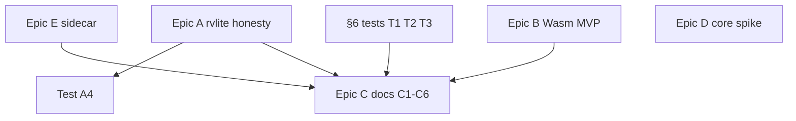

# Todos derived from RVF persistence ecosystem research

**Source:** [RVF_PERSISTENCE_ECOSYSTEM_RESEARCH.md](../analysis/rvf/RVF_PERSISTENCE_ECOSYSTEM_RESEARCH.md) (research deliverable; not ADR-029 itself).

## Completeness double-check (success criteria)

Used a **completeness gate** (not a full design session) to validate coverage:

- **Purpose:** Ensure no research section implies work that lacks a todo, deferral, or doc owner.
- **Success criteria:**
  - Every **§10 gap** maps to at least one todo or the **backlog-tier8** bucket.
  - Every **§11 epic** has concrete tasks with **done-when** aligned to the research wording.
  - **§6 recommended** tests are explicit todos; **§6 existing** regression suites are referenced for CI discipline.
  - **§2 matrix** rows that are not “fix now” appear in **Epic C** or **backlog** (no silent drops).

**Approach:** Prefer **honesty + tests first** (Epic A, sidecar, Wasm throws), then **published limitations** (Epic C), then **Wasm durability MVP** (Epic B), then **core spike** (Epic D). Long-horizon **§8/§9** items stay in **backlog-tier8** unless product reprioritizes.

## Sequential thinking (what was missing on first pass)

1. **§2 `createRvLite` default row** — Misleading RVF labeling when `rvf_store_*` is not wired into init is distinct from `getStorageBackend()` string; added **p0-a0-default-init-doc** (or fold into A3 if implementing one fix for both).
2. **§2 `ruvector` npm** — Default **REDB** vs **`RUVECTOR_BACKEND=rvf`** belongs in the **known limitations** matrix, not only in the older internal research plan — merged into **p2-c1**.
3. **§2 `ruvector-extensions`** and **§8 interop** — Parallel persistence story needs a **doc row or backlog** — **p2-c5**.
4. **§2 `crates/rvlite` vs npm `rvlite`** — Readers conflate Rust adapter with JS package — **p2-c6**.
5. **§2 Hooks / `.ruvector`** — User-facing memory ≠ `.rvf` file — **p2-c4** so Epic C is not only Node vs Wasm.
6. **§4 WasmBackend** — Beyond open/deleteByFilter: **compact** no-op, **lineage/segments** throw, **BigInt IDs** — optional **p1-t3-wasmbackend-extras** so tests match the full limitations table.
7. **§6 existing** — Workflows gate Rust CLI / rvf-node but **not** full ADR npm SLO — **ci-adr-slo-note** (document deferral or file follow-up issue).
8. **§8 security/SLO** — npm **provenance**, **targeted CI** for WASM tile SLO — folded into **backlog-tier8-full** with explicit bullets in the audit table below.
9. **§11 Epic E** — “Embedding string table in RVF meta” is **future format** — **p1-e3-format-future** so it is not lost.
10. **§9 `rvf-adapters`** — Partial ADR coverage → **audit** item in backlog, not a P0 code change.

## Principles (unchanged)

- **Truth before marketing:** Fix or rename misleading APIs before new features.
- **Owner boundaries:** `npm/packages/rvlite`, `npm/packages/rvf`, `npm/packages/rvf-wasm`, `crates/ruvector-core`, `crates/ruvllm`, `ui/ruvocal`, `npm/packages/ruvector` (MCP/docs only where §10 lists MCP).

## Recommended order

## Task tables (by wave)

### Wave P0 — rvlite honesty (Epic A)

| Todo id | Task | Acceptance (research §11.1) | Primary paths |
|---------|------|----------------------------|---------------|
| **p0-a0** | Default `createRvLite` / init wiring documented or fixed | §2 row: label matches behavior | [`npm/packages/rvlite/src/index.ts`](../../npm/packages/rvlite/src/index.ts) |
| **p0-a1** | README + JSDoc honest about JSON vs binary | No false expectation of ADR-029 file from `saveToRvf` default path | [`npm/packages/rvlite/README.md`](../../npm/packages/rvlite/README.md) |
| **p0-a2** | Dead `writeRvf`/`readRvf` branch or real binary path | No dead branch implying binary RVF | rvlite + [`rvf_wasm.d.ts`](../../npm/packages/rvf-wasm/pkg/rvf_wasm.d.ts) |
| **p0-a3** | `getStorageBackend()` semantics | String does not overstate RVF wiring (§3) | rvlite |
| **p0-a4** | On-disk format test | §6.2 — magic bytes or post-fix binary assert | rvlite tests |

### Wave P1 — `@ruvector/rvf` + tests (Epic E + §6)

| Todo id | Task | Acceptance | Primary paths |
|---------|------|------------|---------------|
| **p1-e1** / **p1-e2** | Sidecar doc + optional test | §6.3, §11.5 | [`npm/packages/rvf`](../../npm/packages/rvf), tests |
| **p1-e3** | Format future (meta embedding) | Tracked; no scope creep in P0 | backlog discussion |
| **p1-t1** | Node lifecycle | §6.1 | `npm/packages/rvf` or ruvector + env |
| **p1-t2** / **p1-t3** | WasmBackend throws + optional full §4 asserts | §6.4 + §4 table | [`npm/packages/rvf`](../../npm/packages/rvf) |

### Wave P2 — Documentation (Epic C)

| Todo id | Task | Acceptance (§11.3) |
|---------|------|-------------------|
| **p2-c1** | Known limitations | §4 table + **ruvector default vs RVF backend** (§2) |
| **p2-c2** | MCP vs Rust `rvf` CLI | §8 row |
| **p2-c3** | RuVocal naming | §7 doc-only |
| **p2-c4** | Hooks vs binary `.rvf` | §2 footnote in matrix |
| **p2-c5** | ruvector-extensions vs RVF | §2 + §8 interop pointer |
| **p2-c6** | Rust npm rvlite cross-link | §2 disambiguation |

### Wave P3 — Wasm durability MVP (Epic B)

| Todo id | Task | Acceptance (§11.2) |
|---------|------|-------------------|
| **p3-b1**–**b3** | Export semantics, OPFS/IDB path, boundary doc | As in prior plan |
| **p3-b4** | Optional product API | Tier B from older [rvf_persistence_research_4bac0840.plan.md](./rvf_persistence_research_4bac0840.plan.md) |

### Wave P4 — Spike (Epic D)

| Todo id | Task | Acceptance (§11.4) |
|---------|------|------------------|
| **p4-d1** | ruvector-core spike | Read or dual-write proof; no prod flip |

## Coverage audit (research section → todo)

| Research | Covered by |
|----------|------------|
| §1 executive summary | P0 + C1 + C3 |
| §2 full matrix | C1, C4, C5, C6, A0, A3 |
| §3 rvlite contract | A1–A4 |
| §4 Wasm vs Node | C1, T2, T3, B1–B4 |
| §5 ADR-029 table | D1, backlog (out-of-tree agents) |
| §6 existing CI gap | **ci-adr-slo-note** |
| §6 recommended 1–4 | T1, A4, E2, T2/T3 |
| §7 RuVocal | C3 |
| §8 Tier D/E | **backlog-tier8-full** |
| §9 peripheral | **backlog-tier8-full** (brain, ruvllm, adapters audit) |
| §10 gap list | P0–P4 + backlog |
| §11 epics A–E | Waves P0–P4 + E3 |

## Future epics (split from former `backlog-tier8-full`)

Previously a single mega-bucket; now labeled for grooming and issue tracking.

| Epic | Scope | Research source | Key packages / crates |
|------|-------|----------------|-----------------------|
| **F1 — Import + migration** | `rvf-import` CLI batch validation; success criteria for legacy→RVF conversion; mixed-version fleet handling | §8 interop | `crates/rvf/rvf-import`, `npm/packages/ruvector-extensions` |
| **F2 — Ops / FS locking** | Multi-process locking, concurrent open (CLI + server), NFS/cloud-sync behavior, backup/restore, compaction scheduling, corruption detection | §8 ops | `crates/rvf/rvf-runtime`, `npm/packages/rvf` |
| **F3 — npm provenance + CI** | npm provenance signing for `@ruvector/rvf-node` native addon platform matrix; targeted WASM SLO CI gating npm publish | §8 security/supply-chain | `crates/rvf/rvf-node`, `npm/packages/rvf-wasm`, CI workflows |
| **F4 — rvf-adapters audit** | Verify each adapter (agentdb, agentic-flow, ospipe, rvlite-rust, sona) default store format, test coverage, and whether npm/CLI docs claim parity they lack | §9 adapters | `crates/rvf/rvf-adapters/*` |
| **F5 — Brain + RuVLLM trace** | mcp-brain-server end-to-end RVF path (embed → store → optional container); ruvllm session/policy storage vs ADR-029 KV-cache/LoRA/RAG spec | §9 peripheral | `crates/mcp-brain-server`, `crates/ruvllm` |

These are **not sequenced** relative to W0–W4; groom into GitHub issues when product prioritizes.

## Explicit out-of-repo / verify externally

- **claude-flow memory**, standalone **agentdb** CLI (§5, §8) — not verified in-repo; do not block local epics.

## Cross-reference

- Research execution order vs ruvector MCP: [research_streams_execution_order_d0f4d7b3.plan.md](./research_streams_execution_order_d0f4d7b3.plan.md)
- Prior research-phase plan (matrix / structured review): [rvf_persistence_research_4bac0840.plan.md](./rvf_persistence_research_4bac0840.plan.md)
- Nomenclature (MCP contracts): [cli_mcp_nomenclature_todos_e2d8271a.plan.md](./cli_mcp_nomenclature_todos_e2d8271a.plan.md)
- CLI/MCP ecosystem parity: [cli_mcp_ecosystem_research_todos_beb308b1.plan.md](./cli_mcp_ecosystem_research_todos_beb308b1.plan.md)

## Cross-plan audit (structured review + sequential thinking)

**Completeness gate:** Persistence plan covers **packages outside** `npm/packages/ruvector` (rvlite, rvf, rvf-wasm, core, RuVocal). RuVector MCP `rvf_*` behavior stays in nomenclature + ecosystem plans.

| Persistence todo | Relationship to other plans |
|------------------|----------------------------|
| `p2-c2-mcp-cli-delta` | **Dedupe** with ecosystem `docs-parity-surface-matrix` via **`dedupe-p2c2-ecosystem-docs`** + ecosystem `coord-mcp-rvf-doc-canonical` |
| `p2-c1-known-limitations` | Nomenclature `readme-mcp-cli-table` should **link** here for Node vs Wasm + `RUVECTOR_BACKEND` |
| Epic A (rvlite) | **Upstream** of ecosystem **E5** public docs (`coord-rvlite-doc-persistence` on ecosystem plan) |
| `p1-t1-node-lifecycle` | Optional complement to ecosystem **MCP smoke** (different entrypoint: `@ruvector/rvf` vs stdio MCP) |

**No duplicate ownership:** `validateRvfPath` module extraction = **ecosystem E4** only. MCP `db_path` naming = **nomenclature** only.

## References (research §12)

- [ADR-029](../../docs/adr/ADR-029-rvf-canonical-format.md)
- [`npm/packages/rvf/src/backend.ts`](../../npm/packages/rvf/src/backend.ts)
- [`npm/packages/rvlite/src/index.ts`](../../npm/packages/rvlite/src/index.ts)
- [`npm/packages/rvf-wasm/pkg/rvf_wasm.d.ts`](../../npm/packages/rvf-wasm/pkg/rvf_wasm.d.ts)
- [`crates/ruvector-core/src/storage.rs`](../../crates/ruvector-core/src/storage.rs)
- [`ui/ruvocal/src/lib/server/database/rvf.ts`](../../ui/ruvocal/src/lib/server/database/rvf.ts)
